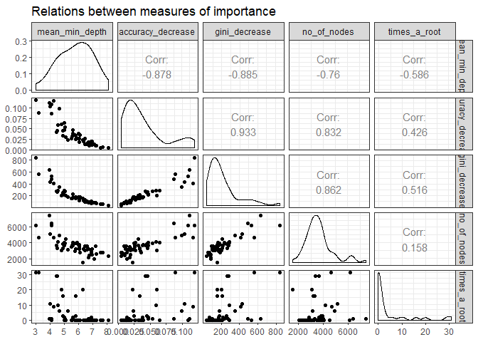

```r
#Load Libraries
library(caret)
library(ggplot2)
library(dplyr)
library(rpart)
library(rattle)
library(randomForest)
library(randomForestExplainer)
```

# Background
Using devices such as Jawbone Up, Nike FuelBand, and Fitbit it is now possible to collect a large amount of data about personal activity relatively inexpensively. These type of devices are part of the quantified self movement - a group of enthusiasts who take measurements about themselves regularly to improve their health, to find patterns in their behavior, or because they are tech geeks. One thing that people regularly do is quantify how much of a particular activity they do, but they rarely quantify how well they do it. The goal of this project is to use data from accelerometers on the belt, forearm, arm, and dumbbell of 6 participants as they perform barbell lifts correctly and incorrectly 5 different ways.

Six young healthy participants were asked to perform one set of 10 repetitions of the Unilateral Dumbbell Biceps Curl in five different fashions:
* Class A - exactly according to the specification
* Class B - throwing the elbows to the front
* Class C - lifting the dumbbell only halfway
* Class D - lowering the dumbbell only halfway
* Class E - throwing the hips to the front

Class A corresponds to the specified execution of the exercise, while the other 4 classes correspond to common mistakes. Participants were supervised by an experienced weight lifter to make sure the execution complied to the manner they were supposed to simulate. The exercises were performed by six male participants aged between 20-28 years, with little weight lifting experience. Researchers made sure that all participants could easily simulate the mistakes in a safe and controlled manner by using a relatively light dumbbell (1.25kg).

#Data
The training data for this project are available at:

https://d396qusza40orc.cloudfront.net/predmachlearn/pml-training.csv

The test data are available at:

https://d396qusza40orc.cloudfront.net/predmachlearn/pml-testing.csv

## Data Loading
Download the data sets and classify them as Training and Test.

```r
#Load Training
fileUrl.train <- "https://d396qusza40orc.cloudfront.net/predmachlearn/pml-training.csv"
path <- getwd()
download.file(fileUrl.train, destfile = paste0(path,'/pml-training.csv'))
train.df <- read.csv("pml-training.csv")

#Load Testing
fileUrl.test <- "https://d396qusza40orc.cloudfront.net/predmachlearn/pml-testing.csv"
path <- getwd()
download.file(fileUrl.test, destfile = paste0(path,'/pml-testing.csv'))
test.df <- read.csv("pml-testing.csv")
```
## Data Processing
Through the data process, what ever is done to the training set must also be done to the test set to ensure the same variables were used when running the model.

Drop the first 7 columns as they're unnecessary for predicting.

```r
train.df.clean1 <- train.df[,8:length(colnames(train.df))]
test.df.clean1 <- test.df[,8:length(colnames(test.df))]
```
Drop colums with NAs

```r
train.df.clean2 <- train.df.clean1[, colSums(is.na(train.df.clean1)) == 0] 
test.df.clean2 <- test.df.clean1[, colSums(is.na(train.df.clean1)) == 0] 
```
Check for near zero variance predictors and drop them if necessary

```r
nzv <- nearZeroVar(train.df.clean2,saveMetrics=TRUE)
zero.var.ind <- sum(nzv$nzv)

if ((zero.var.ind>0)) {
        train.df.clean2 <- train.df.clean2[,nzv$nzv==FALSE]
        test.df.clean2 <- test.df.clean2[,nzv$nzv==FALSE]
        }
```

## Cross Validation
The training data is divided into two sets. This first is a training set with 70% of the data which is used to train the model. The second is a validation set used to assess model performance.

```r
in.training <- createDataPartition(train.df.clean2$classe , p=0.70, list=F)
train.df.final <- train.df.clean2[in.training, ]
validate.df.final <- train.df.clean2[-in.training, ]
```

# Model Development
## Train Model
The training data-set is used to fit a Random Forest model because it automatically selects important variables and is robust to correlated covariates & outliers in general. A Random Forest algorithm is a way of averaging multiple deep decision trees, trained on different parts of the same data-set, with the goal of reducing the variance. This typically produces better performance at the expense of bias and interpret-ability.

```r
set.seed(123)
rf.model <- randomForest(classe ~ ., data = train.df.final, ntree = 251, localImp = TRUE)
rf.model
```

```
## 
## Call:
##  randomForest(formula = classe ~ ., data = train.df.final, ntree = 251,      localImp = TRUE) 
##                Type of random forest: classification
##                      Number of trees: 251
## No. of variables tried at each split: 7
## 
##         OOB estimate of  error rate: 0.5%
## Confusion matrix:
##      A    B    C    D    E  class.error
## A 3903    2    0    0    1 0.0007680492
## B    9 2640    9    0    0 0.0067720090
## C    0    8 2385    3    0 0.0045909850
## D    0    0   26 2224    2 0.0124333925
## E    0    0    2    7 2516 0.0035643564
```

## Estimate performance
The model fit using the training data is tested against the validation data. Predicted values for the validation data are then compared to the actual values. This allows forecasting the accuracy and overall out-of-sample error, which indicate how well the model will perform with other data.

```r
rf.predict <- predict(rf.model, validate.df.final)
confusion <- confusionMatrix(validate.df.final$classe, rf.predict)
confusion
```

```
## Confusion Matrix and Statistics
## 
##           Reference
## Prediction    A    B    C    D    E
##          A 1674    0    0    0    0
##          B    4 1132    3    0    0
##          C    0    3 1020    3    0
##          D    0    0    9  955    0
##          E    0    0    0    1 1081
## 
## Overall Statistics
##                                           
##                Accuracy : 0.9961          
##                  95% CI : (0.9941, 0.9975)
##     No Information Rate : 0.2851          
##     P-Value [Acc > NIR] : < 2.2e-16       
##                                           
##                   Kappa : 0.9951          
##                                           
##  Mcnemar's Test P-Value : NA              
## 
## Statistics by Class:
## 
##                      Class: A Class: B Class: C Class: D Class: E
## Sensitivity            0.9976   0.9974   0.9884   0.9958   1.0000
## Specificity            1.0000   0.9985   0.9988   0.9982   0.9998
## Pos Pred Value         1.0000   0.9939   0.9942   0.9907   0.9991
## Neg Pred Value         0.9991   0.9994   0.9975   0.9992   1.0000
## Prevalence             0.2851   0.1929   0.1754   0.1630   0.1837
## Detection Rate         0.2845   0.1924   0.1733   0.1623   0.1837
## Detection Prevalence   0.2845   0.1935   0.1743   0.1638   0.1839
## Balanced Accuracy      0.9988   0.9979   0.9936   0.9970   0.9999
```


```r
acc.out <- confusion$overall[[1]][1]
overall.ose <- 1 - confusion$overall[[1]][1]
```
## Results
The accuracy of this model is 0.9960918 and the Overall Out-of-Sample error is 0.0039082.

# Run the model
The model is applied to the test data to produce the results.

```r
results <- predict(rf.model, 
                   test.df.clean2[, -length(names(test.df.clean2))])
results
```

```
##  1  2  3  4  5  6  7  8  9 10 11 12 13 14 15 16 17 18 19 20 
##  B  A  B  A  A  E  D  B  A  A  B  C  B  A  E  E  A  B  B  B 
## Levels: A B C D E
```
# Appendix - Decision Tree Visualization
## Appendix 1: Tree Plot

```r
treeModel <- rpart(classe ~ ., data=train.df.final, method="class")
fancyRpartPlot(treeModel)
```

```
## Warning: labs do not fit even at cex 0.15, there may be some overplotting
```

<!-- -->
 
## Appendix 2: Importance Plot & Pairs

```r
#Multi-way importance plot
importance_frame <- measure_importance(rf.model)
```

```
## Warning: Factor `split var` contains implicit NA, consider using
## `forcats::fct_explicit_na`

## Warning: Factor `split var` contains implicit NA, consider using
## `forcats::fct_explicit_na`
```

```r
plot_multi_way_importance(importance_frame)
```

<!-- -->

```r
#plot of pairs
plot_importance_ggpairs(importance_frame)
```

<!-- -->
